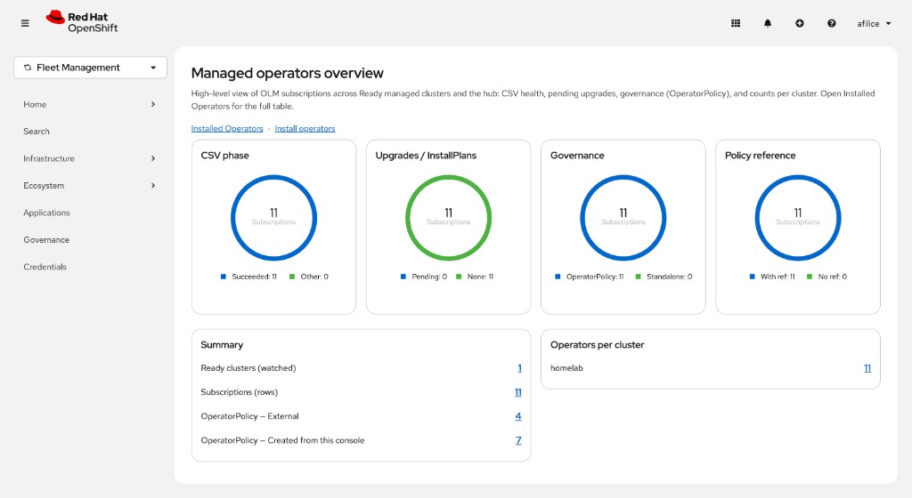
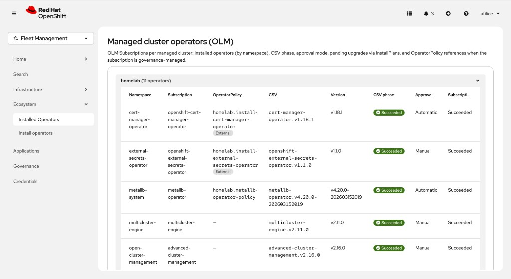
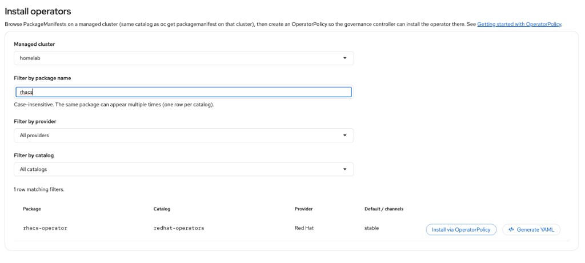
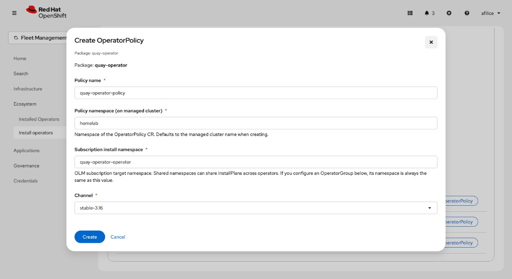

# managed-operators-plugin

Dynamic console plugin for **Red Hat Advanced Cluster Management (RHACM)** / **multicluster engine (MCE)**. It extends the OpenShift console in the **All clusters (ACM)** perspective with views for OLM operators on managed clusters.

## Features

- **Overview** (`/multicloud/ecosystem/managed-operators-overview`): dashboard-style summary with **ChartDonut** cards (CSV health, pending upgrades, governance vs standalone OLM, policy reference) plus per-cluster counts and links to the other plugin pages.
- **Installed Operators** (`/multicloud/ecosystem/installed-operators`): OLM **Subscriptions** for each cluster (hub and/or managed), CSV status, InstallPlan approval, **OperatorPolicy** references where present; **Edit policy** only when the `OperatorPolicy` was created from this plugin (annotation `console.openshift.io/managed-operators-plugin-created=true`). Policies reconciled from a hub **Policy**, GitOps, or YAML (no plugin annotation) are labeled **External** — change them via RHACM / GitOps, not **Uninstall** here (the subscription would be recreated). **Uninstall** is offered for governance-backed installs that are **not** external (e.g. created from this plugin’s flow), understanding the OperatorPolicy may still recreate the Subscription until the policy is removed or changed; **Migrate to OperatorPolicy** for manual OLM installs (opt-in label `managed-operators-plugin.openshift.io/enroll-operator-policy=true`, then create a matching policy from **Install operators** or automation).
- **Install operators** (`/multicloud/ecosystem/install-operators`): guided install flow aligned with OperatorPolicy and catalogs.

All three pages are registered in `console-extensions.json` (routes + **Ecosystem** nav). **Overview** is the first menu item and the natural entry point for the plugin; it ships with the same build as **Installed Operators** and **Install operators** once you deploy the plugin.

Under **Fleet Management → Ecosystem** (after **Infrastructure**), the console lists **Overview**, then **Installed Operators**, then **Install operators**.

## Screenshots

From the **Fleet Management → Ecosystem** menu in the ACM console.

### Overview

Dashboard with **ChartDonut** cards (CSV phase, upgrades, governance, policy reference), center totals, legends, and summary counts per cluster.



### Managed cluster operators (Installed Operators)

OLM subscriptions per cluster, CSV phase, OperatorPolicy reference (with **External** when not created from this plugin).




### Install operators

Choose a Ready cluster, filter **PackageManifests**, then **Install via OperatorPolicy** or edit an existing policy.



### Create OperatorPolicy

Modal to name the policy, namespaces, channel, and related OLM fields before create.



## Kubernetes APIs and MCE proxy

Calls use `consoleFetchJSON` from the dynamic plugin SDK. Cluster API paths are built with `clusterApiPath()` in `src/utils/clusterApi.ts`:

- **Hub (current session)** — special key `__hub_direct__`: the API path is used as-is (e.g. `/apis/...` against the console session you are logged into).
- **Managed cluster** — same Kubernetes API path, prefixed with the **MCE console proxy** to the spoke:

  ```text
  /api/proxy/plugin/mce/console/multicloud/managedclusterproxy/{managedClusterName}{path}
  ```

  Example to list OLM catalog data on cluster `prod-west-1`:

  ```text
  /api/proxy/plugin/mce/console/multicloud/managedclusterproxy/prod-west-1/apis/packages.operators.coreos.com/v1/packagemanifests
  ```

  The cluster name is passed through `encodeURIComponent` when needed for URL safety.

### Resources and verbs (summary)

| API group | Resource | Role in the plugin |
|-----------|----------|-------------------|
| `packages.operators.coreos.com/v1` | `PackageManifest` (list) | **Install operators**: available operators from the OLM catalog on the selected cluster (same idea as `oc get packagemanifest`). |
| `operators.coreos.com/v1alpha1` | `CatalogSource` (`openshift-marketplace`) | Catalog filters / context on **Install operators** and where needed on **Installed Operators**. |
| `operators.coreos.com/v1alpha1` | `Subscription` (cluster-wide list) | **Installed Operators**: what is installed; **DELETE** Subscription to uninstall. |
| `operators.coreos.com/v1alpha1` | `InstallPlan` (list) | **Installed Operators**: pending upgrades, manual approval, plan phase. |
| `operators.coreos.com/v1alpha1` | `ClusterServiceVersion` (by namespace/name) | **Installed Operators**: CSV phase and version for the subscription. |
| `policy.open-cluster-management.io/v1beta1` | `OperatorPolicy` (list, GET, POST, PUT) | **Install operators** and edits from **Installed Operators**: governance policy on the cluster (namespaced paths). |

`ManagedCluster` (`cluster.open-cluster-management.io/v1`) is watched on the **hub** via the console client (`useK8sWatchResource`) to determine which clusters are selectable and **Available**.

## Requirements

- **OpenShift** with the console and dynamic plugins enabled.
- **RHACM / MCE** with the ACM perspective in the console (the plugin registers with `perspective: "acm"`).
- Kubernetes/OpenShift permissions to read Subscription, CSV, InstallPlan, CatalogSource, OperatorPolicy, and to use the proxy APIs toward managed clusters (per your environment’s policy).

## UI / PatternFly

The console and this plugin use **PatternFly 6**. Use **`pf-v6-u-*` utility classes** (not `pf-v5-u-*`) so spacing and colors match the host console. For wide data tables, prefer **`OuterScrollContainer`** / **`InnerScrollContainer`** from `@patternfly/react-table` and set **`gridBreakPoint=""`** on **`Table`** to avoid responsive “stacked card” layout breaking the ACM page shell.

## Local development

Prerequisites: **Node.js** (see Dockerfile, e.g. 22), **Yarn** (this repo uses Yarn 4 via `packageManager`; enable **Corepack**: `corepack enable`).

```bash
yarn install --immutable
```

- **Watch build** for the plugin (webpack dev server on port **9001**):

  ```bash
  yarn start
  ```

- **Local OpenShift Console** connected to a cluster (`oc` configured with a token):

  ```bash
  yarn start-console
  ```

  The script runs the console in a container and expects the plugin from `yarn start` (see `start-console.sh` for `CONSOLE_PORT` and console image variables).

- **Production build** (output in `dist/`):

  ```bash
  yarn build
  ```

- **Lint**:

  ```bash
  yarn lint
  ```

- **End-to-end (Cypress)**:

  ```bash
  yarn test-cypress
  # or
  yarn test-cypress-headless
  ```

## Container image, push, and Helm install

The `Dockerfile` runs `yarn install` and `yarn build` in a Node stage and copies `dist/` into an **nginx** image (static files on port 9443 with TLS via the chart). You do not need to run `yarn build` on the host first unless you want to check `dist/` locally.

### 1. Build and push the image

Use **`linux/amd64`** when building on Apple Silicon so the image runs on typical OpenShift nodes. Replace the image name with your registry and tag (example: `quay.io/YOUR_ORG/managed-operators-plugin:v0.0.1`).

**Podman:**

```bash
export IMAGE=quay.io/YOUR_ORG/managed-operators-plugin:v0.0.1
podman build --platform linux/amd64 -t "$IMAGE" .
podman push "$IMAGE"
```

One-liner equivalent:

```bash
podman build --platform linux/amd64 -t quay.io/YOUR_ORG/managed-operators-plugin:v0.0.1 . \
  && podman push quay.io/YOUR_ORG/managed-operators-plugin:v0.0.1
```

**Docker** (same idea):

```bash
docker build --platform linux/amd64 -t "$IMAGE" .
docker push "$IMAGE"
```

Log in to your registry (`podman login quay.io`, etc.) before pushing.

### 2. Install or upgrade with Helm

The chart is `charts/openshift-console-plugin/`. Set **`plugin.image`** to the same tag you pushed. Defaults for plugin name, TLS, and the console patch job are in `charts/openshift-console-plugin/values.yaml`.

**Using `--set`:**

```bash
helm upgrade -i managed-operators-plugin charts/openshift-console-plugin \
  -n managed-operators-plugin --create-namespace \
  --set plugin.image=quay.io/YOUR_ORG/managed-operators-plugin:v0.0.1
```

**Using a values file** — copy `helm-values.example.yaml`, set `plugin.image`, then:

```bash
helm upgrade -i managed-operators-plugin charts/openshift-console-plugin \
  -n managed-operators-plugin --create-namespace \
  -f helm-values.example.yaml
```

After deploy, ensure the cluster **Console** loads the plugin (the chart can run a post-install Job to add the plugin name to `Console` spec; see chart notes).

## Roadmap / next features

Planned and under consideration. Contributions and design discussion are welcome via issues.

### High-priority ideas

1. **Minor-version patterns for governed upgrades** — `OperatorPolicy` does not accept arbitrary regex for CSV / version pins. A thin **wrapper or controller-side convention** (or hub-side automation) could resolve patterns such as `smb-csi-driver-operator.v4.20.*`, `advanced-cluster-management.v2.16.*`, or `cert-manager-operator.v1.18.*` into the latest matching **minor** only (no automatic major jumps), then materialize the concrete version the policy applies. Scope: **minor-line automation** only, with clear safety rules and auditability.

2. **YAML tab on install / edit** — Besides the guided form, add a **read/write YAML** tab when installing or editing an **OperatorPolicy** (and related objects where applicable), for power users and copy-paste from docs.

3. **Generate-only YAML (GitOps-first)** — A flow that **only emits** ready-to-commit manifests (e.g. `OperatorPolicy`, namespaces, labels) for **Git** / **Argo CD** / **RHACM Policy** repos, without applying through the console—useful for teams that forbid direct cluster edits.

### Other ideas

- **Multi-cluster / scale loading** — Page load time grows with the number of **managed clusters** and **Subscriptions** because work is largely **sequential proxy calls** per cluster (subscriptions, CSVs, catalog sources, policy lookups). Next steps: **parallelize** safe requests where possible, **list or batch** data per cluster instead of many narrow GETs, **cache** results for the session (or short TTL), and **progressive UI** (show partial data while the rest loads) so large estates stay usable. *Prototype:* branch `dev/scale-loading` — `usePluginPolicyEditableMap` lists **OperatorPolicies once per cluster** and uses **GET only** for refs missing from that list (same behavior, fewer round-trips when many subscriptions share policies or list coverage is sufficient).*
- **Overview drill-down** — Click-through from chart segments and summary rows to **pre-filtered** Installed Operators or cluster-scoped views.
- **Bulk / multi-cluster patterns** — Select several **Ready** clusters and apply the same install template (behind confirmations and RBAC checks).
- **Stronger testing and docs** — Expand **Cypress** coverage for Overview and policy flows; document **RBAC** matrices and proxy requirements for managed clusters.
- **More locales** — Additional language packs beyond `en` once strings stabilize.

## Repository layout (summary)

| Path | Contents |
|------|----------|
| `src/components/` | React pages exposed by the plugin (`MyCustomPage`, `InstallOperatorsPage`, …) |
| `src/hooks/` | Subscription/CSV/catalog/policy fetching |
| `console-extensions.json` | ACM routes and navigation |
| `locales/en/` | i18n strings (`plugin__managed-operators-plugin`) |
| `charts/openshift-console-plugin/` | Helm chart |
| `integration-tests/` | Cypress |

## License

Apache-2.0 (see `package.json`).
